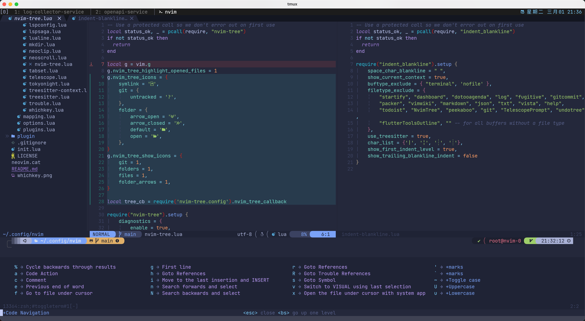

# My NeoVIM configuration

## Pre-Installation Required
* [ripgrep](https://github.com/BurntSushi/ripgrep)
* [rust-analyzer](https://github.com/rust-analyzer/rust-analyzer)
* [gopls](https://github.com/golang/tools/tree/master/gopls)
* [revive](https://github.com/mgechev/revive)
* [goimports](https://github.com/bradfitz/goimports)
* [dlv](https://github.com/go-delve/delve)
* [impl](https://github.com/josharian/impl)
* [lolcat](https://github.com/jaseg/lolcat)
* [lua-language-server](https://github.com/sumneko/lua-language-server)
* [phpactor](https://github.com/phpactor/phpactor)
* [lazygit](https://github.com/jesseduffield/lazygit)
* ...(to be completed)

## Usage
The \<leader\> is mapped into space.

Type `:WhichKey` in **COMMAND MODE** to show all key maps.

